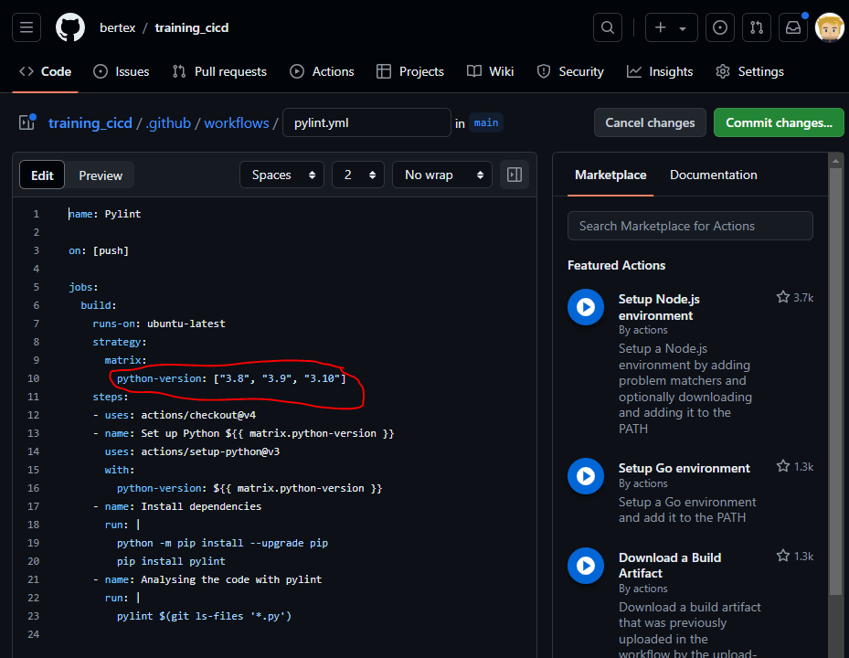
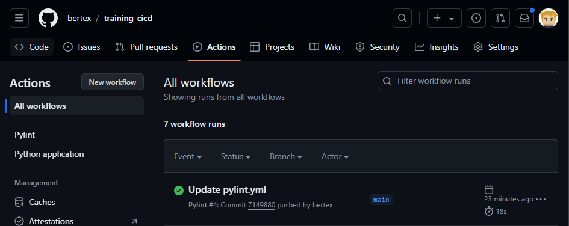

# Workshop with GitHub Actions

This workshop, through a Python project, seeks to show how a CI/CD pipeline can be implemented using GitLab CI/CD.

## Requirements

- Have a GitHub account.
- Have a project on GitHub.
- Have Git installed.

## Step 0 - Fork this repository

1. To get started, fork this repository into your GitLab account.
If you have forked before, you can update your repository as follows:
    - From the UI: https://docs.gitlab.com/ee/user/project/repository/forking_workflow.html#from-the-ui
    ! [Fork from UI] (https://docs.gitlab.com/ee/user/project/repository/img/update-fork_v16_6.png)

    - Or by command line:
        ```bash
        git remote add upstream https://<repositorio-workshop>/workshop-cicd.git
        git fetch upstream
        git pull upstream master
        ```
2. The next step is to clone or update your repository on your local machine. To do this, run the following commands in your terminal:
    - Clone repository:
        ```bash
        git clone https://<your-repository>/workshop-cicd.git
        cd workshop-cicd
        ```
     - Or update repository:
        ```bash
        git fetch origin
        git pull origin main
        ```
## Paso 1 - Run the initial GitHub Actions pipeline
1. Open the project in GitHub
2. Click on 'Actions' in the top menu.
3. Click on 'Configure' that appears in the selection.


4. Before using the "commit" button, edit the line shown in this image and remove "3.8 and 3.9" (you don't need to check this code in 3 different versions of python with 3.10 is enough)
   


6. Press the "commit" button
7. Click on 'Actions' in the top menu again and if everything Works right you will see:
   



## Step 2 – Add test and coverage

1. Open file .github/workflows/pylint.yml
2. Modify the following part to install pytest and coverage
```
run: |
        python -m pip install --upgrade pip
        pip install pylint pytest coverage
```
3. Add new step by adding this line at the bottom of the file
   ```
   - name: Test with pytest
      run: |
        pytest test.py
        coverage run -m pytest test.py
        coverage report
   ```
4. Configure "Build":
   ```
   - name: Install pypa/build
      run: >-
        python3 -m
        pip install
        build
        --user
    - name: Build a binary wheel and a source tarball
      run: python3 -m build
    - name: Store the distribution packages
      uses: actions/upload-artifact@v3
      with:
        name: python-package-distributions
        path: dist/
   ```
